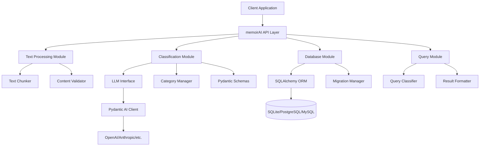

# Design Document

## Overview

The memoirAI library is designed as a modular Python package that provides LLM-powered hierarchical text storage and retrieval. The system uses a configurable category hierarchy (1-100 levels, default 3) stored in a relational database, with intelligent text chunking and LLM-based classification. The architecture emphasizes modularity, database agnosticism, and structured LLM interactions through Pydantic AI.

## Architecture

### High-Level Architecture



### Core Components

1. **API Layer**: Simple, developer-friendly interface
2. **Text Processing**: Intelligent chunking with configurable parameters
3. **Classification Engine**: LLM-powered hierarchical categorization
4. **Database Layer**: ORM-based data persistence with migrations
5. **Query Engine**: Natural language query processing and retrieval

## Components and Interfaces

### 1. Core API Interface

```python
class MemoirAI:
    def __init__(
        self,
        database_url: str,
        llm_provider: str = "openai",
        hierarchy_depth: int = 3,
        chunk_min_size: int = 200,
        chunk_max_size: int = 1200,
        **kwargs
    ):
        """Initialize memoirAI with configuration parameters."""

    async def ingest_text(
        self,
        content: str,
        metadata: Optional[Dict] = None
    ) -> IngestionResult:
        """Ingest and categorize text content."""

    async def query(
        self,
        query_text: str,
        limit: int = 10,
        include_metadata: bool = True
    ) -> QueryResult:
        """Query stored content using natural language."""

    def get_category_tree(self) -> CategoryTree:
        """Retrieve the complete category hierarchy."""
```

### 2. Text Processing Module

```python
class TextChunker:
    def __init__(self, min_size: int, max_size: int, delimiters: List[str]):
        """Initialize chunker with size constraints and delimiters."""

    def chunk_text(self, content: str) -> List[TextChunk]:
        """Split text into meaningful chunks respecting size constraints."""

    def _preserve_paragraph_boundaries(self, chunks: List[str]) -> List[str]:
        """Ensure chunks don't break mid-paragraph."""

    def _merge_small_chunks(self, chunks: List[str]) -> List[str]:
        """Combine chunks below minimum size threshold."""

class TextChunk:
    content: str
    start_position: int
    end_position: int
    metadata: Dict[str, Any]
```

### 3. Classification Module

```python
class CategoryClassifier:
    def __init__(self, llm_client: PydanticAIClient, hierarchy_depth: int):
        """Initialize classifier with LLM client and hierarchy configuration."""

    async def classify_chunk(
        self,
        chunk: TextChunk,
        existing_categories: CategoryTree
    ) -> ClassificationResult:
        """Classify a text chunk through the category hierarchy."""

    async def _classify_level(
        self,
        chunk: TextChunk,
        level: int,
        parent_category: Optional[Category],
        existing_options: List[Category]
    ) -> Category:
        """Classify chunk at a specific hierarchy level."""

class CategoryManager:
    def get_existing_categories(self, level: int, parent_id: Optional[int]) -> List[Category]:
        """Retrieve existing categories at specified level and parent."""

    def create_category(self, name: str, level: int, parent_id: Optional[int]) -> Category:
        """Create new category with validation."""

    def ensure_category_path(self, path: List[str]) -> Category:
        """Ensure complete category path exists, creating as needed."""
```

### 4. Pydantic Schemas for LLM Interactions

```python
class CategorySelection(BaseModel):
    category_name: str = Field(description="Name of the selected or new category")
    is_new_category: bool = Field(description="Whether this is a new category")
    confidence_score: float = Field(ge=0.0, le=1.0, description="Confidence in classification")
    reasoning: str = Field(description="Brief explanation for the classification choice")

class ClassificationPrompt(BaseModel):
    chunk_content: str
    hierarchy_level: int
    existing_categories: List[str]
    parent_category_path: Optional[List[str]]
    max_categories_per_level: int = 128

class QueryClassificationResult(BaseModel):
    selected_path: List[str]
    confidence_scores: List[float]
    fallback_levels: List[int]
```

### 5. Database Layer

```python
# SQLAlchemy Models
class Category(Base):
    __tablename__ = 'categories'

    id: int = Column(Integer, primary_key=True)
    name: str = Column(String(255), nullable=False)
    level: int = Column(SmallInteger, nullable=False)
    parent_id: Optional[int] = Column(Integer, ForeignKey('categories.id'))
    slug: str = Column(String(255), unique=True)
    metadata: Dict = Column(JSON)
    created_at: datetime = Column(DateTime, default=datetime.utcnow)
    updated_at: datetime = Column(DateTime, default=datetime.utcnow, onupdate=datetime.utcnow)

    # Relationships
    parent = relationship("Category", remote_side=[id])
    children = relationship("Category", back_populates="parent")
    chunks = relationship("Chunk", back_populates="category")

    # Constraints
    __table_args__ = (
        UniqueConstraint('name', 'parent_id', name='unique_name_per_parent'),
        CheckConstraint('level >= 1 AND level <= 100', name='valid_level'),
        CheckConstraint('(level = 1 AND parent_id IS NULL) OR (level > 1 AND parent_id IS NOT NULL)',
                       name='parent_level_consistency'),
        Index('idx_parent_id', 'parent_id'),
    )

class Chunk(Base):
    __tablename__ = 'chunks'

    id: int = Column(Integer, primary_key=True)
    content: str = Column(Text, nullable=False)
    category_id: int = Column(Integer, ForeignKey('categories.id'), nullable=False)
    source_metadata: Dict = Column(JSON)
    created_at: datetime = Column(DateTime, default=datetime.utcnow)
    updated_at: datetime = Column(DateTime, default=datetime.utcnow, onupdate=datetime.utcnow)

    # Relationships
    category = relationship("Category", back_populates="chunks")

    # Constraints
    __table_args__ = (
        Index('idx_category_id', 'category_id'),
        Index('idx_created_at', 'created_at'),
    )
```

### 6. Query Processing Module

```python
class QueryProcessor:
    def __init__(self, classifier: CategoryClassifier, db_session: Session):
        """Initialize query processor with classifier and database session."""

    async def process_query(self, query_text: str, limit: int) -> QueryResult:
        """Process natural language query and return relevant chunks."""

    async def _classify_query(self, query_text: str) -> List[Category]:
        """Classify query through category hierarchy."""

    def _retrieve_chunks(self, categories: List[Category], limit: int) -> List[ChunkWithPath]:
        """Retrieve chunks from database with fallback logic."""

    def _format_results(self, chunks: List[ChunkWithPath]) -> QueryResult:
        """Format database results for API response."""
```

## Data Models

### Category Hierarchy Model

The category system uses a self-referential tree structure with the following properties:

- **Configurable Depth**: 1-100 levels (default 3)
- **Parent-Child Relationships**: Each category (except level 1) has exactly one parent
- **Unique Names**: Category names are unique within the same parent scope
- **Leaf-Only Chunks**: Text chunks are only stored at the deepest configured level

### Database Schema

```sql
-- Categories table with hierarchy support
CREATE TABLE categories (
    id INTEGER PRIMARY KEY AUTOINCREMENT,
    name VARCHAR(255) NOT NULL,
    level SMALLINT NOT NULL CHECK (level >= 1 AND level <= 100),
    parent_id INTEGER REFERENCES categories(id),
    slug VARCHAR(255) UNIQUE,
    metadata JSON,
    created_at TIMESTAMP DEFAULT CURRENT_TIMESTAMP,
    updated_at TIMESTAMP DEFAULT CURRENT_TIMESTAMP,

    CONSTRAINT unique_name_per_parent UNIQUE (name, parent_id),
    CONSTRAINT parent_level_consistency CHECK (
        (level = 1 AND parent_id IS NULL) OR
        (level > 1 AND parent_id IS NOT NULL)
    )
);

-- Chunks table
CREATE TABLE chunks (
    id INTEGER PRIMARY KEY AUTOINCREMENT,
    content TEXT NOT NULL,
    category_id INTEGER NOT NULL REFERENCES categories(id),
    source_metadata JSON,
    created_at TIMESTAMP DEFAULT CURRENT_TIMESTAMP,
    updated_at TIMESTAMP DEFAULT CURRENT_TIMESTAMP
);

-- Indexes for performance
CREATE INDEX idx_categories_parent_id ON categories(parent_id);
CREATE INDEX idx_categories_level ON categories(level);
CREATE INDEX idx_chunks_category_id ON chunks(category_id);
CREATE INDEX idx_chunks_created_at ON chunks(created_at);

-- View for chunk retrieval with full category path
CREATE VIEW chunk_with_category_path AS
WITH RECURSIVE category_path AS (
    SELECT id, name, level, parent_id, name as path
    FROM categories
    WHERE parent_id IS NULL

    UNION ALL

    SELECT c.id, c.name, c.level, c.parent_id,
           cp.path || ' → ' || c.name as path
    FROM categories c
    JOIN category_path cp ON c.parent_id = cp.id
)
SELECT
    ch.id,
    ch.content,
    ch.created_at,
    cp.path as category_path,
    cp.id as category_id
FROM chunks ch
JOIN category_path cp ON ch.category_id = cp.id;
```

## Error Handling

### Classification Error Handling

1. **LLM Response Validation**: Use Pydantic schemas to validate all LLM responses
2. **Retry Logic**: Implement exponential backoff for failed LLM calls (max 3 retries)
3. **Fallback Categories**: Create "Uncategorized" categories when classification fails
4. **Confidence Thresholds**: Reject classifications below configurable confidence levels

### Database Error Handling

1. **Connection Resilience**: Implement connection pooling and automatic reconnection
2. **Transaction Management**: Use database transactions for multi-step operations
3. **Constraint Violations**: Provide clear error messages for hierarchy violations
4. **Migration Safety**: Validate schema changes before applying migrations

### Input Validation

1. **Content Sanitization**: Escape SQL injection attempts and validate input encoding
2. **Size Limits**: Enforce maximum content size limits to prevent memory issues
3. **Hierarchy Validation**: Validate hierarchy depth configuration on initialization
4. **Category Name Validation**: Sanitize category names and enforce naming conventions

## Testing Strategy

### Unit Testing

1. **Text Chunking**: Test boundary conditions, delimiter handling, and size constraints
2. **Classification Logic**: Mock LLM responses to test classification workflows
3. **Database Operations**: Test CRUD operations, constraints, and migrations
4. **API Endpoints**: Test all public methods with various input scenarios

### Integration Testing

1. **End-to-End Workflows**: Test complete ingestion and query workflows
2. **Database Integration**: Test with all supported database backends
3. **LLM Integration**: Test with multiple LLM providers through Pydantic AI
4. **Error Scenarios**: Test error handling and recovery mechanisms

### Performance Testing

1. **Chunking Performance**: Benchmark chunking speed with large documents
2. **Classification Latency**: Measure LLM response times and token usage
3. **Database Performance**: Test query performance with large category trees
4. **Concurrent Operations**: Test thread safety and concurrent access patterns

### Test Data Management

1. **Fixtures**: Create reusable test data for categories and chunks
2. **Database Seeding**: Automated test database setup and teardown
3. **Mock LLM Responses**: Deterministic test responses for classification
4. **Performance Baselines**: Establish performance benchmarks for regression testing
