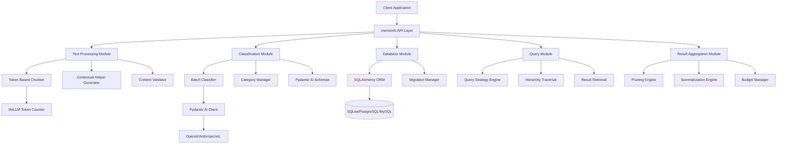

# Design Document

## Overview

The memoirAI library is designed as a modular Python package that provides LLM-powered hierarchical text storage and retrieval with advanced query strategies and result aggregation. The system uses a configurable category hierarchy (1-100 levels, default 3) stored in a relational database, with token-based text chunking, batch classification, contextual helpers, and sophisticated query processing with pruning or summarization strategies. The architecture emphasizes modularity, database agnosticism, and structured LLM interactions through Pydantic AI with native structured outputs.

## Architecture

### High-Level Architecture



### Core Components

1. **API Layer**: Simple, developer-friendly interface with async/sync support
2. **Text Processing**: Token-based chunking with contextual helper generation
3. **Batch Classification**: Multi-chunk LLM classification with category limits
4. **Database Layer**: ORM-based data persistence with migrations
5. **Query Strategy Engine**: Four configurable traversal strategies
6. **Result Aggregation**: Pruning and summarization with budget management

## Components and Interfaces

### 1. Core API Interface

```python
from typing import Optional, Dict, List, Union
from enum import Enum

class PromptLimitingStrategy(Enum):
    PRUNE = "PRUNE"
    SUMMARIZE = "SUMMARIZE"

class QueryStrategy(Enum):
    ONE_SHOT = "one_shot"
    WIDE_BRANCH = "wide_branch"
    ZOOM_IN = "zoom_in"
    BRANCH_OUT = "branch_out"

class MemoirAI:
    def __init__(
        self,
        database_url: str,
        llm_provider: str = "openai",
        hierarchy_depth: int = 3,
        chunk_min_tokens: int = 300,
        chunk_max_tokens: int = 500,
        model_name: str = "gpt-4",
        batch_size: int = 5,
        max_categories_per_level: Union[int, Dict[int, int]] = 128,
        auto_source_identification: bool = True,
        **kwargs
    ):
        """Initialize memoirAI with configuration parameters."""

    async def ingest_text(
        self,
        content: str,
        source_id: str,
        contextual_helper: Optional[str] = None,
        metadata: Optional[Dict] = None
    ) -> IngestionResult:
        """Ingest and categorize text content with batch processing."""

    async def query(
        self,
        query_text: str,
        strategy: QueryStrategy = QueryStrategy.ONE_SHOT,
        strategy_params: Optional[Dict] = None,
        prompt_limiting_strategy: PromptLimitingStrategy = PromptLimitingStrategy.PRUNE,
        max_token_budget: int = 40000,
        use_rankings: bool = True,
        limit: int = 10
    ) -> QueryResult:
        """Query stored content using natural language with configurable strategies."""

    def get_category_tree(self) -> CategoryTree:
        """Retrieve the complete category hierarchy."""

    async def regenerate_contextual_helper(self, source_id: str) -> str:
        """Regenerate contextual helper for a source."""
```

### 2. Text Processing Module

```python
from litellm import token_counter
from typing import List, Optional, Dict, Any

class TextChunker:
    def __init__(
        self,
        min_tokens: int = 300,
        max_tokens: int = 500,
        delimiters: List[str] = [".", "\n"],
        model_name: str = "gpt-4"
    ):
        """Initialize chunker with token-based size constraints and delimiters."""
        self.min_tokens = min_tokens
        self.max_tokens = max_tokens
        self.delimiters = delimiters
        self.model_name = model_name

    def chunk_text(self, content: str, source_id: str | None = None) -> List[TextChunk]:
        """Split text into meaningful chunks respecting token size constraints."""

    def _count_tokens(self, text: str) -> int:
        """Count tokens using liteLLM's token_counter function."""
        return token_counter(model=self.model_name, text=text)

    def _preserve_paragraph_boundaries(self, chunks: List[str]) -> List[str]:
        """Ensure chunks don't break mid-paragraph using configured delimiters."""

    def _merge_small_chunks(self, chunks: List[str]) -> List[str]:
        """Combine chunks below minimum token threshold."""

    def _split_large_chunks(self, chunks: List[str]) -> List[str]:
        """Split chunks above maximum token threshold into multiple chunks."""

class TextChunk:
    content: str
    token_count: int
    start_position: int
    end_position: int
    source_id: Optional[str]
    metadata: Dict[str, Any]

class ContextualHelperGenerator:
    def __init__(self, auto_source_identification: bool = True, max_tokens: int = 300):
        """Initialize contextual helper generator."""
        self.auto_mode = auto_source_identification
        self.max_tokens = max_tokens

    async def generate_helper(
        self,
        source_id: str,
        chunks: List[TextChunk],
        metadata: Dict[str, Any] = None
    ) -> str:
        """Generate contextual helper from source metadata and first chunks."""

    def collect_user_helper(self, source_id: str) -> str:
        """Collect contextual helper information from user input."""

    def _extract_metadata(self, chunks: List[TextChunk], metadata: Dict) -> Dict:
        """Extract author, date, topic from available data."""

    def _validate_iso_date(self, date_str: str) -> bool:
        """Validate ISO 8601 date format."""
```

### 3. Batch Classification Module

```python
from pydantic_ai import Agent, NativeOutput
from pydantic import BaseModel, Field
from typing import List, Optional, Union

class ChunkClassificationRequest(BaseModel):
    chunk_id: int
    category: str

class BatchClassificationResponse(BaseModel):
    chunks: List[ChunkClassificationRequest]

class CategorySelection(BaseModel):
    category: str = Field(description="Name of the selected or new category")
    ranked_relevance: int = Field(description="Relevance ranking from 1 to N")

class BatchCategoryClassifier:
    def __init__(
        self,
        llm_client: Agent,
        hierarchy_depth: int,
        batch_size: int = 5,
        max_categories_per_level: Union[int, Dict[int, int]] = 128
    ):
        """Initialize batch classifier with LLM client and configuration."""

    async def classify_chunks_batch(
        self,
        chunks: List[TextChunk],
        level: int,
        parent_category: Optional[Category],
        existing_categories: List[Category],
        contextual_helper: str
    ) -> List[ClassificationResult]:
        """Classify multiple chunks in a single LLM call."""

    def _create_batch_prompt(
        self,
        chunks: List[TextChunk],
        existing_categories: List[Category],
        contextual_helper: str,
        level: int
    ) -> str:
        """Create structured prompt for batch classification."""

    def _validate_batch_response(
        self,
        response: BatchClassificationResponse,
        chunk_count: int
    ) -> bool:
        """Validate batch classification response."""

    async def _retry_failed_chunks(
        self,
        failed_chunks: List[TextChunk],
        level: int,
        existing_categories: List[Category],
        contextual_helper: str
    ) -> List[ClassificationResult]:
        """Retry classification for failed chunks individually."""

class CategoryManager:
    def __init__(self, max_categories_config: Union[int, Dict[int, int]]):
        """Initialize category manager with limits configuration."""

    def get_existing_categories(self, level: int, parent_id: Optional[int]) -> List[Category]:
        """Retrieve existing categories at specified level and parent."""

    def can_create_category(self, level: int, parent_id: Optional[int]) -> bool:
        """Check if new category can be created at this level."""

    def create_category(self, name: str, level: int, parent_id: Optional[int]) -> Category:
        """Create new category with validation and limits enforcement."""

    def get_category_limit(self, level: int) -> int:
        """Get maximum categories allowed at specified level."""
```

### 4. Query Strategy Engine

```python
from enum import Enum
from typing import List, Dict, Optional

class QueryStrategyEngine:
    def __init__(self, classifier: BatchCategoryClassifier):
        """Initialize query strategy engine."""

    async def execute_strategy(
        self,
        query_text: str,
        strategy: QueryStrategy,
        strategy_params: Dict,
        contextual_helper: Optional[str] = None
    ) -> List[CategoryPath]:
        """Execute specified query strategy to find relevant category paths."""

    async def _one_shot_strategy(
        self,
        query_text: str,
        contextual_helper: Optional[str]
    ) -> List[CategoryPath]:
        """Execute one-shot strategy: single category at each level."""

    async def _wide_branch_strategy(
        self,
        query_text: str,
        n: int,
        contextual_helper: Optional[str]
    ) -> List[CategoryPath]:
        """Execute wide branch: N categories at each level."""

    async def _zoom_in_strategy(
        self,
        query_text: str,
        n: int,
        n2: int,
        contextual_helper: Optional[str]
    ) -> List[CategoryPath]:
        """Execute zoom in: N categories decreasing by N2 each level."""

    async def _branch_out_strategy(
        self,
        query_text: str,
        n: int,
        n2: int,
        contextual_helper: Optional[str]
    ) -> List[CategoryPath]:
        """Execute branch out: N categories increasing by N2 each level."""

class CategoryPath:
    path: List[Category]
    ranked_relevance: int

class QueryClassificationResult(BaseModel):
    category: str
    ranked_relevance: int
```

### 5. Result Aggregation Module

```python
from typing import List, Optional, Dict, Union
from litellm import token_counter

class ResultAggregator:
    def __init__(
        self,
        prompt_limiting_strategy: PromptLimitingStrategy,
        max_token_budget: int,
        model_name: str = "gpt-4"
    ):
        """Initialize result aggregator with budget and strategy configuration."""

    async def aggregate_results(
        self,
        category_paths: List[CategoryPath],
        query_text: str,
        contextual_helper: Optional[str] = None,
        use_rankings: bool = True
    ) -> AggregationResult:
        """Aggregate query results using configured strategy."""

    def _retrieve_chunks(self, paths: List[CategoryPath]) -> List[ChunkWithPath]:
        """Retrieve chunks from database for given category paths."""

    def _estimate_token_usage(
        self,
        fixed_text: str,
        chunks: List[ChunkWithPath]
    ) -> TokenEstimate:
        """Estimate token usage for prompt construction."""

    async def _prune_results(
        self,
        chunks: List[ChunkWithPath],
        token_estimate: TokenEstimate,
        use_rankings: bool
    ) -> PruningResult:
        """Prune results to fit within token budget."""

    async def _summarize_results(
        self,
        chunks: List[ChunkWithPath],
        token_estimate: TokenEstimate
    ) -> SummarizationResult:
        """Summarize results to fit within token budget."""

class PruningEngine:
    def prune_by_rankings(
        self,
        chunks: List[ChunkWithPath],
        target_tokens: int
    ) -> List[ChunkWithPath]:
        """Prune chunks using ranked relevance scores."""

    def prune_by_order(
        self,
        chunks: List[ChunkWithPath],
        target_tokens: int
    ) -> List[ChunkWithPath]:
        """Prune chunks using deterministic order only."""

class SummarizationEngine:
    def __init__(
        self,
        llm_client: Agent,
        summarization_instruction_headroom_tokens: int = 1024,
        summary_char_overage_tolerance_percent: int = 5,
        summary_max_retries: int = 1
    ):
        """Initialize summarization engine with configuration."""

    async def summarize_chunks(
        self,
        chunks: List[ChunkWithPath],
        required_compression_ratio: float
    ) -> List[SummarizedChunk]:
        """Summarize chunks to achieve target compression ratio."""

    def _partition_chunks_for_summarization(
        self,
        chunks: List[ChunkWithPath],
        max_tokens_per_part: int
    ) -> List[List[ChunkWithPath]]:
        """Partition chunks into token-safe parts for summarization."""

    async def _summarize_part(
        self,
        chunk_part: List[ChunkWithPath],
        target_char_counts: Dict[int, int]
    ) -> List[SummarizedChunk]:
        """Summarize a single part containing multiple chunks."""
```

### 6. Pydantic AI Schemas with Native Output Support

```python
from pydantic_ai import Agent, NativeOutput
from pydantic import BaseModel, Field
from typing import List, Literal

# Native Output schemas for supported models
class CategorySelectionNative(BaseModel):
    category: str = Field(description="Selected category name")
    ranked_relevance: int = Field(description="Relevance ranking")

class BatchClassificationNative(BaseModel):
    chunks: List[ChunkClassificationRequest]

class SummarizationResponseNative(BaseModel):
    summaries: List[Dict[str, Union[int, str]]] = Field(
        description="List of chunk summaries with chunk_id and summary"
    )

class FinalAnswerNative(BaseModel):
    answer: str = Field(description="Final answer to the user query")

# Agent configuration with native output support
def create_classification_agent(model: str) -> Agent:
    """Create classification agent with native output if supported."""
    if model.startswith("openai:") or model.startswith("grok:") or model.startswith("gemini:"):
        return Agent(
            model,
            output_type=NativeOutput(
                CategorySelectionNative,
                name="CategorySelection",
                description="Select the most relevant category"
            )
        )
    else:
        # Fallback to standard schema enforcement
        return Agent(model, output_type=CategorySelectionNative)

def create_batch_classification_agent(model: str) -> Agent:
    """Create batch classification agent with native output if supported."""
    if model.startswith("openai:") or model.startswith("grok:") or model.startswith("gemini:"):
        return Agent(
            model,
            output_type=NativeOutput(
                BatchClassificationNative,
                name="BatchClassification",
                description="Classify multiple chunks into categories"
            )
        )
    else:
        return Agent(model, output_type=BatchClassificationNative)
```

## Data Models

### Enhanced Database Schema

```sql
-- Categories table with hierarchy support and limits
CREATE TABLE categories (
    id INTEGER PRIMARY KEY AUTOINCREMENT,
    name VARCHAR(255) NOT NULL,
    level SMALLINT NOT NULL CHECK (level >= 1 AND level <= 100),
    parent_id INTEGER REFERENCES categories(id),
    slug VARCHAR(255) UNIQUE,
    metadata JSON,
    created_at TIMESTAMP DEFAULT CURRENT_TIMESTAMP,
    updated_at TIMESTAMP DEFAULT CURRENT_TIMESTAMP,

    CONSTRAINT unique_name_per_parent UNIQUE (name, parent_id),
    CONSTRAINT parent_level_consistency CHECK (
        (level = 1 AND parent_id IS NULL) OR
        (level > 1 AND parent_id IS NOT NULL)
    )
);

-- Chunks table with source tracking
CREATE TABLE chunks (
    id INTEGER PRIMARY KEY AUTOINCREMENT,
    content TEXT NOT NULL,
    token_count INTEGER NOT NULL,
    category_id INTEGER NOT NULL REFERENCES categories(id),
    source_id VARCHAR(255),
    source_metadata JSON,
    created_at TIMESTAMP DEFAULT CURRENT_TIMESTAMP,
    updated_at TIMESTAMP DEFAULT CURRENT_TIMESTAMP
);

-- Contextual helpers table
CREATE TABLE contextual_helpers (
    id INTEGER PRIMARY KEY AUTOINCREMENT,
    source_id VARCHAR(255) UNIQUE NOT NULL,
    helper_text TEXT NOT NULL,
    token_count INTEGER NOT NULL,
    is_user_provided BOOLEAN DEFAULT FALSE,
    version INTEGER DEFAULT 1,
    created_at TIMESTAMP DEFAULT CURRENT_TIMESTAMP,
    updated_at TIMESTAMP DEFAULT CURRENT_TIMESTAMP
);

-- Category limits configuration table
CREATE TABLE category_limits (
    level INTEGER PRIMARY KEY,
    max_categories INTEGER NOT NULL,
    created_at TIMESTAMP DEFAULT CURRENT_TIMESTAMP
);

-- Performance indexes
CREATE INDEX idx_categories_parent_id ON categories(parent_id);
CREATE INDEX idx_categories_level ON categories(level);
CREATE INDEX idx_chunks_category_id ON chunks(category_id);
CREATE INDEX idx_chunks_source_id ON chunks(source_id);
CREATE INDEX idx_chunks_created_at ON chunks(created_at);
CREATE INDEX idx_contextual_helpers_source_id ON contextual_helpers(source_id);

-- Enhanced view for chunk retrieval with full category path
CREATE VIEW chunk_with_category_path AS
WITH RECURSIVE category_path AS (
    SELECT id, name, level, parent_id, name as path, CAST(id AS TEXT) as id_path
    FROM categories
    WHERE parent_id IS NULL

    UNION ALL

    SELECT c.id, c.name, c.level, c.parent_id,
           cp.path || ' → ' || c.name as path,
           cp.id_path || '/' || CAST(c.id AS TEXT) as id_path
    FROM categories c
    JOIN category_path cp ON c.parent_id = cp.id
)
SELECT
    ch.id,
    ch.content,
    ch.token_count,
    ch.source_id,
    ch.created_at,
    cp.path as category_path,
    cp.id_path as category_id_path,
    cp.id as category_id
FROM chunks ch
JOIN category_path cp ON ch.category_id = cp.id;
```

## Error Handling

### Enhanced Error Handling Strategy

1. **Token Budget Errors**: Clear error messages when budgets cannot be met
2. **Category Limit Enforcement**: Graceful handling when category limits are reached
3. **Batch Processing Errors**: Individual chunk retry logic for failed batches
4. **Summarization Failures**: Retry logic with stricter character limits
5. **Native Output Fallbacks**: Automatic fallback to standard schema validation
6. **Contextual Helper Validation**: User input validation with correction prompts

## Testing Strategy

### Comprehensive Testing Approach

1. **Token Counting Accuracy**: Validate liteLLM token counting across models
2. **Batch Processing**: Test batch size limits and retry mechanisms
3. **Query Strategy Testing**: Validate all four traversal strategies
4. **Budget Management**: Test pruning and summarization under various constraints
5. **Native Output Testing**: Test with and without native structured output support
6. **Contextual Helper Generation**: Test both automatic and user-provided helpers
7. **Performance Benchmarks**: Establish baselines for batch processing and query strategies
